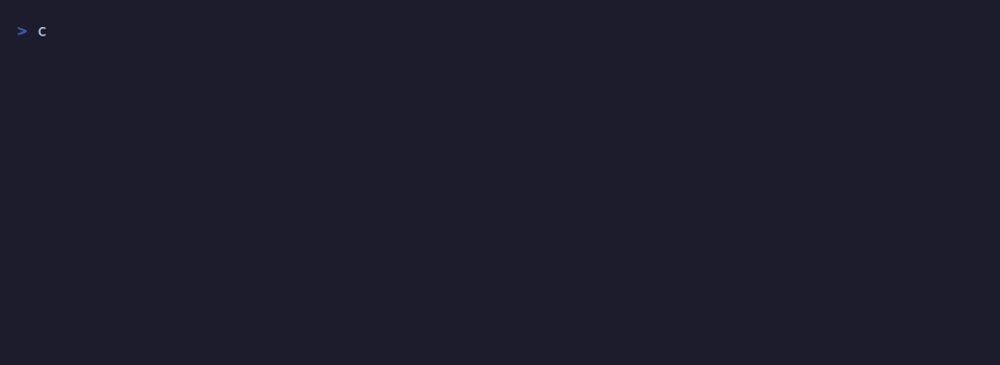

# smart-dispatch

> Claude Code サブエージェント向けの、品質優先の自動モデルルーティング。
> **すべてのタスクに正しいモデルを——デフォルトは最強、確信できる琐碎タスクのみダウングレード。**

[](https://github.com/dudupii/smart-dispatch/actions/workflows/test.yml)
[](https://github.com/dudupii/smart-dispatch/releases)
[](./LICENSE)
[](https://github.com/dudupii/smart-dispatch/stargazers)

[English](README.md) · [简体中文](README.zh-Hans.md) · [繁體中文](README.zh-Hant.md) · [日本語](README.ja.md)

<p align="center"></p>

世の中の「モデルルーター」の多くはコスト最適化のために、難しいタスクで静かに品質を落とします。smart-dispatch は逆です：**ルーティングの判断ミスで品質を落とすことは決してありません。** 許容される誤判定は「簡単なタスクを難しいと扱う」方向（少し無駄な出費）だけ——その逆は決してありません。

## 何をするか

サブエージェントをディスパッチする前に、smart-dispatch は：

1. **安価なモデル**（Haiku）でタスクを分類 → `{tier, confidence}`。
2. **品質優先ポリシー**を適用：デフォルトは `opus`。`tier ∈ {Trivial, Routine}` かつ `confidence ≥ 0.8` のときのみダウングレード。
3. 選ばれたモデルでワーカーエージェントをディスパッチ。

| Tier | 例 | モデル |
|------|----|--------|
| Trivial | grep、ファイル一覧、設定の読み取り | haiku |
| Routine | 定型的な編集、要約、フォーマット | sonnet |
| Hard | 設計、デバッグ、新規コード、アーキテクチャ | opus |
| 不確実 | 曖昧なものすべて | opus（フォールバック） |

ルーター自身が出力する `model` フィールドは**無視されます**——ポリシーは `tier` + `confidence` だけから決定し直します。

## インストール

```bash
claude plugin marketplace add dudupii/smart-dispatch
claude plugin install smart-dispatch@smart-dispatch
```

インストール後、ルーティングは**自動かつ透明**です。`PreToolUse` フックがすべての `Agent` ツール呼び出しを横取りし、`updatedInput` でモデルをその場で書き換えます——コマンドを覚える必要はなく、モデルが Agent ツールを直接呼んでも迂回できません。モデルを明示的に指定した場合は、それを尊重してルーティングをスキップします。

> フックが使うのは保守的なヒューリスティクスです（読み取り専用の `Explore` タスクに加え、短くて読み取り専用／機械的な `general-purpose` プロンプト向けの狭いゲート）。ダウングレードが誤りだった場合、同じタスクの次のディスパッチはセッション既定のモデルへ**自己修復**されます——[オブザーバビリティ](#オブザーバビリティ)を参照。より高精度なルーティング（Haiku 分類器）には `/smart-dispatch` を明示的に呼び出してください——両経路は同じ `src/decide-model.js` ポリシーを共有し、同じログに書き込みます。`SMART_DISPATCH_DRY=1` を設定すると、呼び出しを書き換えずにログだけでルーティング決定をプレビューできます。

## チューニングノブ

チューニングは**ソース編集ではなくデータ**です。デフォルトは `src/decide-model.js`（唯一の信頼できる情報源）にあり、`~/.smart-dispatch/config.json`（パスは `SMART_DISPATCH_CONFIG`）または環境変数で上書きできます：

```json
{
  "downgradeThreshold": 0.8,
  "budgetFloor": 0.1,
  "escalation": { "enabled": true, "windowMinutes": 10 },
  "agentOverrides": { "my-file-finder": "haiku", "my-careful-agent": "never" },
  "priceTable": { "haiku": 0.1, "sonnet": 0.3, "opus": 1.0 }
}
```

- **`downgradeThreshold`**（デフォルト `0.8`、環境変数 `SMART_DISPATCH_THRESHOLD`）—— opus から離れるために必要な信頼度。上げる = より保守的、下げる = より積極的にダウングレード。
- **`budgetFloor`**（デフォルト `0.1`、環境変数 `SMART_DISPATCH_BUDGET_FLOOR`）—— 予算モード（Workflow プロモード）のみ：残り予算がこの割合を下回ると opus が sonnet に下がります。
- **`escalation`**（キルスイッチ：`SMART_DISPATCH_ESCALATION=0`）—— ダウングレード後に再ディスパッチされたタスクの自己修復ウィンドウ。
- **`agentOverrides`** —— サブエージェントタイプごとの固定モデル（ユーザー上書きとしてそのまま適用）、または `"never"` でそのタイプを対象外に。
- **ルーターモデル** —— デフォルトは Haiku（`eval/run-eval.js` で設定）。eval で誤ダウングレードが見られれば Sonnet に引き上げます。

## 検証

```bash
npm install                       # 開発依存関係のみ（@anthropic-ai/sdk）
npm test                          # ユニットテスト：ポリシー、パーサー、メトリクス、データセットスキーマ、プラグイン整合性
ANTHROPIC_API_KEY=xxx npm run eval   # eval/dataset.json で実際のルーティング品質評価
```

eval は 2 つの数字を報告します：

- **falseDowngradeRate** —— Hard タスクが opus 未満にルーティングされた割合。**レッドライン：ほぼ 0。**
- **savingsRate** —— 全 opus ベースラインに対する支出削減率。目標 0.3–0.5。

## どう構築されているか

- `src/decide-model.js` —— 品質優先ポリシー（唯一の信頼できる情報源、完全ユニットテスト済み）。
- `src/classify-heuristic.js` —— フックが使う保守的なヒューリスティック分類器（読み取り専用 `Explore` + general-purpose の狭いゲート）。敵対的テストで門番されています。
- `hooks/route.mjs` + `hooks/hooks.json` —— ルーティングを自動化する `PreToolUse` フック。
- `src/config.js` —— ユーザー設定（ファイル + 環境変数）。例外を投げず、無効な値はフォールバック。
- `src/escalation.js` —— リトライ・エスカレーション：誤ったダウングレードを次のディスパッチで自己修復。
- `src/parse-router-output.js` —— ルーターエージェント出力の防御的パーサー。
- `src/compute-metrics.js` —— 誤ダウングレード率 + 削減率メトリクス。バージョン付き価格テーブルを同梱。
- `skills/smart-dispatch/SKILL.md` —— 同梱のスキル。ポリシーを文章でミラー。
- `.claude-plugin/plugin.json` + `marketplace.json` —— プラグインマニフェストとマーケットプレースエントリ。
- `eval/` —— ラベル付きデータセット + ルーティング品質をエンドツーエンドで検証するハーネス。

同梱プラグインは**ランタイム依存関係ゼロ**です。Anthropic SDK は開発専用で、eval ハーネスのみが使用します。

## プロモード：バッチルーティング（予算適応型）

`workflows/batch-route.js` は、バッチ処理とコスト制御のための [Workflow](https://docs.claude.com/claude-code/workflows) です。同じ品質優先ポリシーに**予算認識**を加えます：残り予算が `budgetFloor` を下回ると、`opus` タスクが `sonnet` に下がります（許容される唯一の opus の下方上書き）。タスク 1 つ、またはタスクの配列を `args` に渡してください。Haiku で各タスクをルーティングし、選ばれたモデルで実行します。

> **注意：** ワークフロースクリプトはサンドボックスで動作しローカルモジュールを `import` できないため、ポリシーはスクリプト内に**インライン**で複製されています（同期ガードテストが門番します）。`src/decide-model.js` が唯一の信頼できる情報源です。実行するとタスクごとにサブエージェントをスポーンするため（マルチエージェントオーケストレーション）、トークンを消費します。

## オブザーバビリティ

毎回のルーティング決定はインラインで 1 行表示され（`smart-dispatch → haiku (Trivial, conf 0.92)`）、ローカルログ `~/.smart-dispatch/log.jsonl` に追記されます——**記録されるのは `tier`、`confidence`、`model`、タイムスタンプ、サブエージェントタイプ、タスクの一方向 `hash` だけで、タスク本文は一切記録されません**。`Retry` エントリは自己修復された各ダウングレード（`escalatedFrom`）を記録します。エスカレーションウィンドウ内で同じタスクが再ディスパッチされ、直前が opus 未満にルーティングされていた場合、フックはダウングレードを差し控え、その修正をログに残します——誤ダウングレード 1 回のコストは安価な試行 1 回であって、タスクの破壊ではありません。

集計統計はいつでも確認できます：

```bash
npm run report                    # またはセッション内で /smart-dispatch-report コマンド
npm run report -- --today         # 今日のみ
npm run report -- --since 7d      # 直近 7 日（24h や 2026-08-01 も可）
npm run report -- --json          # 機械可読フォーマット
```

総決定数、モデル／tier／agent 分布、全 opus 基準の推定節約率（使用したバージョン付き価格テーブルの明記付き——どの価格を使った見積もりかが分かります）、予算モードでのダウングレード頻度、自己修復されたリトライ数を報告します。ログパスは `SMART_DISPATCH_LOG` で上書きできます。

## ライセンス

MIT。
